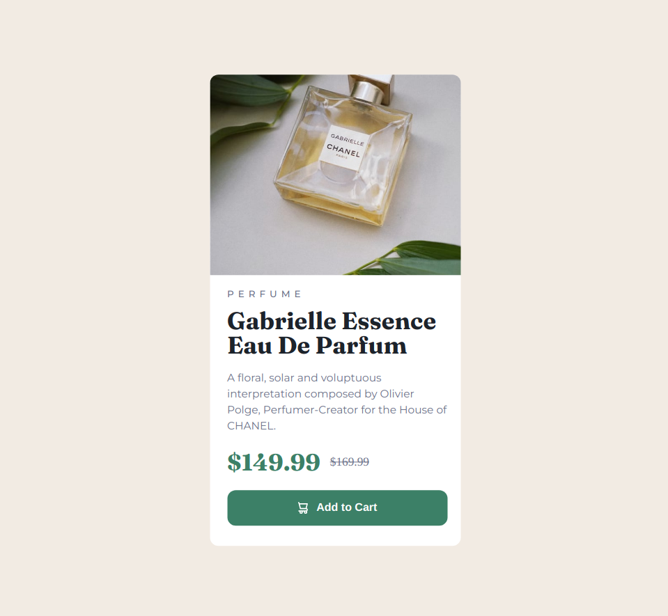

# Frontend Mentor - Product preview card component solution

This is a solution to the [Product preview card component challenge on Frontend Mentor](https://www.frontendmentor.io/challenges/product-preview-card-component-GO7UmttRfa). Frontend Mentor challenges help you improve your coding skills by building realistic projects. 

## Table of contents

- [Overview](#overview)
  - [Screenshot](#screenshot)
  - [Links](#links)
- [My process](#my-process)
  - [Built with](#built-with)
- [Author](#author)

## Overview

### Screenshot

### Links

- Solution URL: [Add solution URL here](https://your-solution-url.com)
- Live Site URL: [Add live site URL here](https://your-live-site-url.com)

## My process

### Built with

- Semantic HTML5 markup
- CSS custom properties
- Flexbox
- Mobile-first workflow

## Author

- Website - [Natnael Dejene](https://github.com/et-coder)
- Frontend Mentor - [@et-coder](https://www.frontendmentor.io/profile/et-coder)
</main>
Excelformulabot
|Linkedin
https://et-coder.github.io/qr-code-component/
https://www.frontendmentor.io/solutions/qr-code-component-YkrWycIQMT
https://github.com/et-coder/qr-code-component
https://github.com/et-coder/qr-code-component.git
## Author

- Website - [Natnael Dejene](https://github.com/et-coder)
- Frontend Mentor - [@et-coder](https://www.frontendmentor.io/profile/et-coder)

https://www.frontendmentor.io/solutions/faq-accordion-0KEczeRQPj
https://et-coder.github.io/faq-accordion/
https://github.com/et-coder/faq-accordion
background-pattern-mobile.svg
@import url('https://fonts.googleapis.com/css2?family=Work+Sans:ital,wght@0,100..900;1,100..900&display=swap');

* {
    padding: 0;
    margin: 0;
    box-sizing: border-box;
}

body {
    font-family: "work sans", sans-serif;
    background-color: hsl(275, 100%, 97%);
    overflow: scroll;
}

.bg {
    background: url("/images/background-pattern-mobile.svg") bottom cover;
    background-image: url("/images/background-pattern-mobile.svg");
    width: 100%;
    height: 33vh;
    background-size: cover;
    background-position: bottom;
}

.container {
    width: 85%;
    max-width: 500px;
    background-color: white;
    position: absolute;
    top: 50%;
    left: 50%;
    transform: translate(-50%, -50%);
    padding: 1.2em 1.2em 0;
    border-radius: 10px;
}

.faq {
    border-bottom: 1px solid hsl(275, 100%, 97%);
}

.faq:last-child {
    border: none;
}

.faq_question {
    position: relative;
}

.faq_answer {
    display: none;
}

.star {
    width: 20px;
}

h1 {
    color: hsl(292, 42%, 14%);
    font-size: 2rem;
    display: inline;
    margin: 1em 0.3em;
}

.question {
    max-width: 80%;
    margin: 1.5em 0;
    margin-right: 1.2em;
}

h2 {
    color: hsl(292, 42%, 14%);
    font-size: 1rem;
    display: inline;
    font-weight: 700;
}

h2:hover {
    color: purple;
    cursor: pointer;
}

span {
    padding: 0;
    margin: 0;
    position: absolute;
    top: 50%;
    right: 0;
    transform: translate(0, -50%);
    border-radius: 50%;
}

span:hover {
    cursor: pointer;
}

span img {
    display: none;
    padding: 0;
}

p {
    margin-bottom: 1.5em;
    color: hsl(292, 16%, 49%);
    font-size: 0.9rem;
    line-height: 1.5;
}

.active {
    display: block;
}

@media only screen and (min-width: 500px) {
    .question {
        max-width: 85%;
    }
}

@media only screen and (min-width: 768px) {

    .faq_question {
        display: flex;
    }

    h1 {
        font-size: 2.5rem;
    }

    .question {
        max-width: 100%;
        flex: 1;
    }

    .star {
        width: 25px;
    }
}

@media only screen and (min-width: 1024px) {

    .bg {
        background-image: url("/images/background-pattern-desktop.svg");
    }
}
@import url('https://fonts.googleapis.com/css2?family=Work+Sans:ital,wght@0,100..900;1,100..900&display=swap');

* {
    padding: 0;
    margin: 0;
    box-sizing: border-box;
}

body {
    font-family: "work sans", sans-serif;
    background-color: hsl(275, 100%, 97%);
    overflow: scroll;
}

.bg {
    background: url("/img/background-pattern-mobile.svg") bottom cover;
    background-image: url("/img/background-pattern-mobile.svg");
    width: 100%;
    height: 33vh;
    background-size: cover;
    background-position: bottom;
}

.container {
    width: 85%;
    max-width: 500px;
    background-color: white;
    position: absolute;
    top: 50%;
    left: 50%;
    transform: translate(-50%, -50%);
    padding: 1.2em 1.2em 0;
    border-radius: 10px;
}

.faq {
    border-bottom: 1px solid hsl(275, 100%, 97%);
}

.faq:last-child {
    border: none;
}

.faq_question {
    position: relative;
}

.faq_answer {
    display: none;
}

.star {
    width: 20px;
}

h1 {
    color: hsl(292, 42%, 14%);
    font-size: 2rem;
    display: inline;
    margin: 1em 0.3em;
}

.question {
    max-width: 80%;
    margin: 1.5em 0;
    margin-right: 1.2em;
}

h2 {
    color: hsl(292, 42%, 14%);
    font-size: 1rem;
    display: inline;
    font-weight: 700;
}

h2:hover {
    color: purple;
    cursor: pointer;
}

span {
    padding: 0;
    margin: 0;
    position: absolute;
    top: 50%;
    right: 0;
    transform: translate(0, -50%);
    border-radius: 50%;
}

span:hover {
    cursor: pointer;
}

span img {
    display: none;
    padding: 0;
}

p {
    margin-bottom: 1.5em;
    color: hsl(292, 16%, 49%);
    font-size: 0.9rem;
    line-height: 1.5;
}

.active {
    display: block;
}

@media only screen and (min-width: 500px) {
    .question {
        max-width: 85%;
    }
}

@media only screen and (min-width: 768px) {

    .faq_question {
        display: flex;
    }

    h1 {
        font-size: 2.5rem;
    }

    .question {
        max-width: 100%;
        flex: 1;
    }

    .star {
        width: 25px;
    }
}

@media only screen and (min-width: 1024px) {

    .bg {
        background-image: url("/img/background-pattern-desktop.svg");
    }
}
# Frontend Mentor - FAQ accordion solution

This is a solution to the [FAQ accordion challenge on Frontend Mentor](https://www.frontendmentor.io/challenges/faq-accordion-wyfFdeBwBz). Frontend Mentor challenges help you improve your coding skills by building realistic projects. 

## Table of contents

- [Overview](#overview)
  - [Screenshot](#screenshot)
  - [Links](#links)
- [My process](#my-process)
  - [Built with](#built-with)
- [Author](#author)

## Overview

### Screenshot

### Links

- Solution URL: [Add solution URL here](https://your-solution-url.com)
- Live Site URL: [Add live site URL here](https://et-coder.github.io/faq-accordion/)

## My process

### Built with

- Semantic HTML5 markup
- CSS custom properties
- Mobile-first workflow
- vanilla javascript

## Author

- Website - [Natnael Dejene](https://github.com/et-coder)
- Frontend Mentor - [@et-coder](https://www.frontendmentor.io/profile/et-coder)
